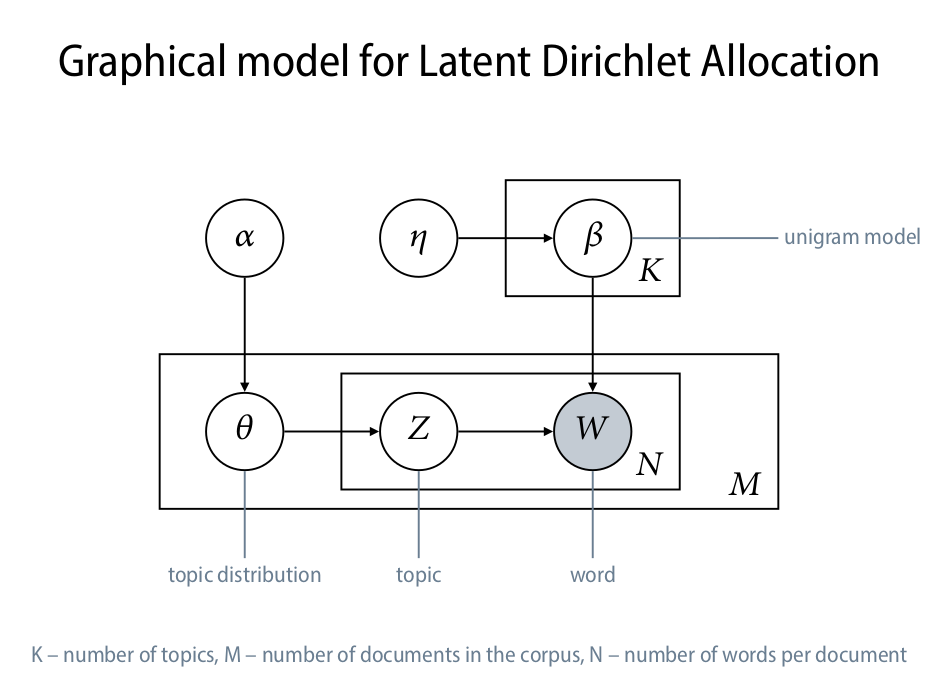
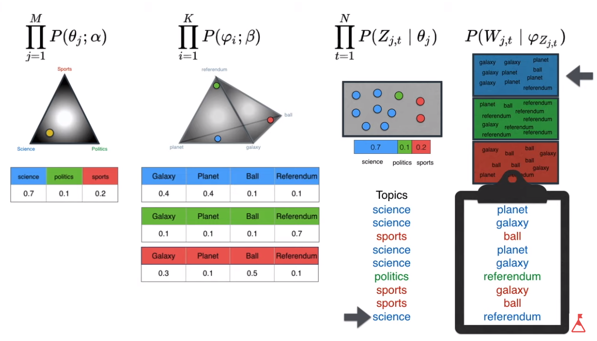

# Latent Dirichlet Allocation

Latent Dirichlet Allocation summary based on this video explanation : https://www.youtube.com/watch?v=T05t-SqKArY

## The problem

We have collection of document and we want to sort them into groups.

## How it works ?

We can see LDA like a goup of machines that produce document. The machine parameters control the nature of the produced document. Then the output documents are compared to the original document and the algorithm is looking for the best machine (best settings) who produced the closest document. In this document we can find the topic.

## Blueprint for the LDA machine

$\alpha$ and $\beta$ are [Dirichlet distribution](https://en.wikipedia.org/wiki/Dirichlet_distribution) and $\theta$ and $\phi$ are [multinomial distribution](https://en.wikipedia.org/wiki/Multinomial_distribution). $z$ and $w$ are respectively the topics and words.

## Document probability

$P(W,Z,\theta,\phi;\alpha,\beta) = \prod_{j=1}^{M}P(\theta_j;\alpha)\prod_{i=1}^{K}P(\phi_i;\beta)\prod_{t=1}^{M}P(Z_{j,t}|\theta_j)P(W_{j,t}|\phi_{j,t})$

This formula is divided in 4 factors :

- The 2 firsts parts are the settings of the machine (hyperparameter). The first two are dirichlet distribution.
- The 2 lasts can be seen as the gears of the machine. This 2 lasts are multinomial distribution

The factors can be associated to 2 distincts process :

- The first and the fird to the topics.
- The second and the last to the words.

### Popularization of the dirichlet distribution
 
It can be seen as tiangle where when $\alpha$ = 0, the distribution probability is uniform when $\alpha$ < 1 the highest probabilty is located on the corners and when $\alpha$ > 1 the highest probabilty is located in the center of the triangle.

Therefore, the two firsts factors can be seen as Dirichlet distributions (repectively topics and words) which the hyperparameters $\alpha$ and $\beta$ choose the position of the samples in the triangle (respectively documents and topics). 

Let's draw a plan of the process in 4 steps :

- First the documents are placed in the probability triangle given a topics distrbution and alpha gives the where the probability is highiest in the triangle. For each document placed in the triangle we can retrieve some topics probability.
- This last draws probabilty enable to create a binomiale distribution. Then we can sample a list of topics.
- Same process with words this time, topics are placed in the probability pyramid and we can get from this a list of probabilities and create a binomial distribution.
- For each lastly draws topics we can draw a word from the related binomial distribution.

# Gibbs sampling

In this part we focus on the words and we want to maximize the color of the documents (to fix).

## References

- https://www.youtube.com/watch?v=T05t-SqKArY

- https://en.wikipedia.org/wiki/Dirichlet_distribution

- https://en.wikipedia.org/wiki/Multinomial_distribution